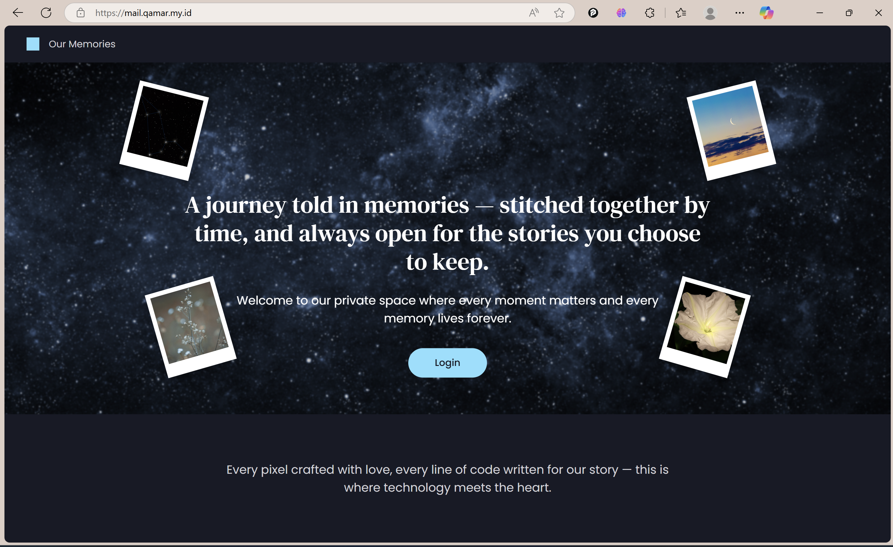

# 🌟 Khairun - Personal Memory & Event Management System

  
  
  
  

Khairun adalah sistem manajemen kenangan dan acara pribadi yang komprehensif, dirancang untuk membantu pengguna mengorganisir, menyimpan, dan berbagi momen berharga dalam hidup mereka.

## 📸 Screenshot Halaman

*Halaman Awal*
*(Di sini tempat untuk menaruh GIF atau link video demo Anda)*

## ✨ Fitur Unggulan
- **✍️ Manajemen Kenangan:** Simpan momen berharga dengan teks, gambar, dan integrasi musik Spotify dalam format timeline yang indah.
- **📅 Kalender & Acara Interaktif:** Atur jadwal, acara, dan pengingat dengan tampilan kalender yang mendukung *drag & drop* dan notifikasi.
- **🎂 Pengiriman Kejutan Ulang Tahun:** Buat dan jadwalkan pengiriman kejutan multi-media untuk orang-orang terkasih Anda.
- **🎵 Integrasi Musik:** Hubungkan kenangan dan acara Anda dengan soundtrack yang sempurna melalui integrasi pencarian Spotify.
- **🔐 Keamanan Berlapis:** Sistem autentikasi Email + Password yang diperkuat dengan verifikasi One-Time Password (OTP) via email (2FA).

## 🏗️ Arsitektur Sistem (Ringkasan)
Sistem ini dibangun di atas **5-Layer Architecture** untuk memastikan pemisahan tanggung jawab (separation of concerns) dan skalabilitas yang baik:
1.  **Presentation Layer (Frontend):** Dibuat dengan Blade, Tailwind CSS, dan Alpine.js.
2.  **Application Layer:** Berisi Controllers dan Middleware yang menangani permintaan HTTP.
3.  **Business Logic Layer:** Inti dari aplikasi yang berisi *Service Classes* dan *Domain Models*.
4.  **Data Layer:** Menggunakan Eloquent ORM dari Laravel dan *Repository Pattern*.
5.  **External Services Layer:** Mengelola integrasi dengan layanan pihak ketiga seperti Spotify API.

## 🗄️ Desain Database (Entitas Utama)
- **Users**: Mengelola data pengguna, profil, dan kredensial.
- **Memories**: Menyimpan konten kenangan (teks, media, link musik).
- **Events**: Mengelola acara, siklus berulang, dan partisipan.
- **Birthday Surprises**: Mengatur konten kejutan dan jadwal pengiriman.

## 🛠️ Tumpukan Teknologi (Tech Stack)
* **Backend:** Laravel, PHP
* **Frontend:** Blade, Tailwind CSS, Alpine.js
* **Database:** MySQL / PostgreSQL
* **Development:** Vite, Composer, NPM

## 🚀 Instalasi Cepat (Quick Start)
1.  **Clone Repository:** `git clone [URL_ANDA]`
2.  **Install Dependencies:** `composer install && npm install`
3.  **Setup Environment:** `cp .env.example .env && php artisan key:generate`
4.  **Migrasi Database:** `php artisan migrate --seed`
5.  **Jalankan Server:** `npm run dev` & `php artisan serve`

## 📖 Dokumentasi Teknis Lengkap
Untuk penjelasan mendalam mengenai **Detail API, Strategi Testing, dan Alur Kerja Deployment**, silakan kunjungi **[Halaman Wiki Proyek ini]([LINK_KE_WIKI_ANDA])**.
